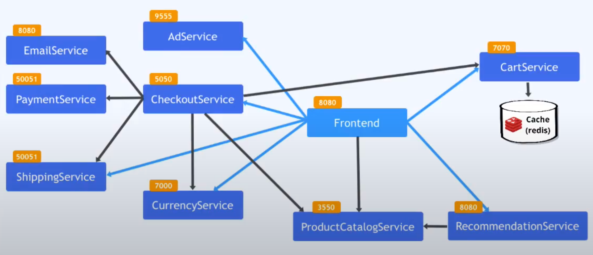

# Online-Shop Deployment Using Helm Charts

## Overview
The Microservices Demo is a cloud-native application showcasing an e-commerce website. It consists of a range of services, each encapsulating a key function of the website. These services include a frontend user interface, a product catalog service, a cart service, a checkout service, and others. Each service is built using different programming languages and frameworks, demonstrating the diversity and interoperability in a microservices architecture. The project is designed to illustrate best practices for Kubernetes.



# Prerequisites
- [Minikube](https://minikube.sigs.k8s.io/docs/start/) - A local Kubernetes cluster environment.
- [kubectl](https://kubernetes.io/docs/tasks/tools/) - A CLI tool for Kubernetes.
- [Helmfile](https://github.com/roboll/helmfile) - For deploying applications using Helm.

## Running the Project Locally with Minikube

### Start Minikube
Initialize your local Kubernetes cluster:
```bash
minikube start
```

### Start Minikube
Clone the Repository:
```bash
git clone git@github.com:oussamalakhdar/KubeShop-Microservices.git
cd KubeShop-Microservices
```

### Deploy with Helmfile
Synchronize your Kubernetes setup using Helmfile:
```bash
helmfile sync
```

### Access the Application
Retrieve the URL for the frontend service and access it in your browser:
```bash
minikube service frontend
```

### Clean Up
To remove the deployed services, run:
```bash
helmfile delete
```
